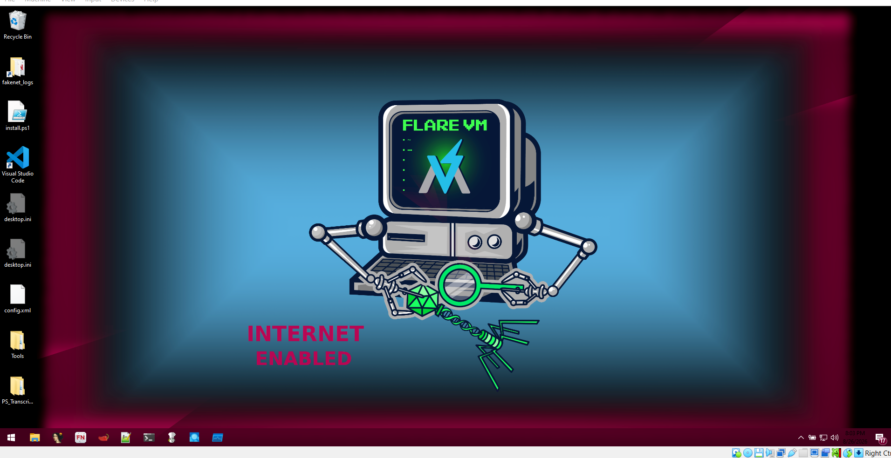
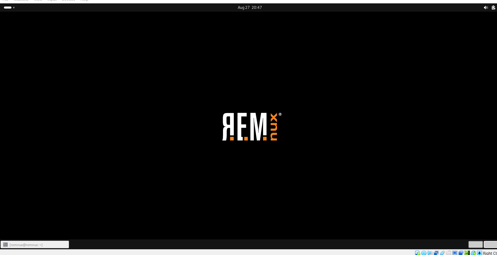
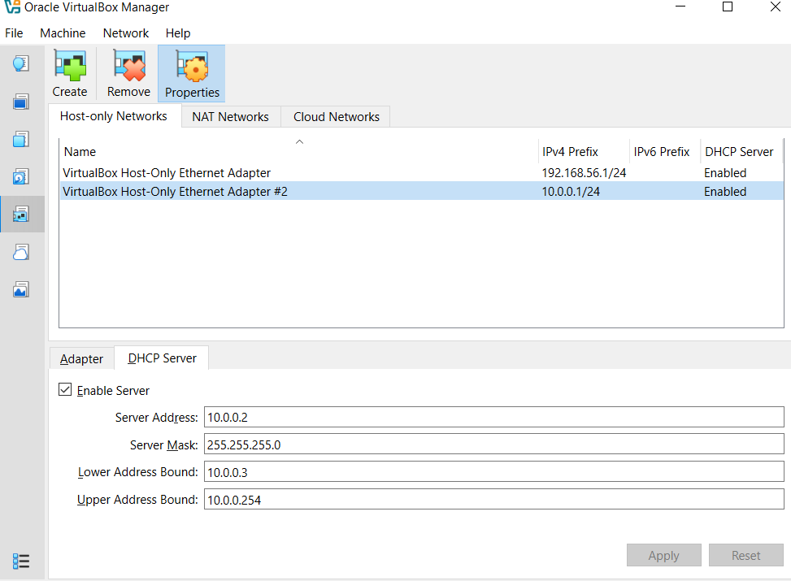
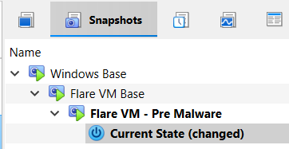
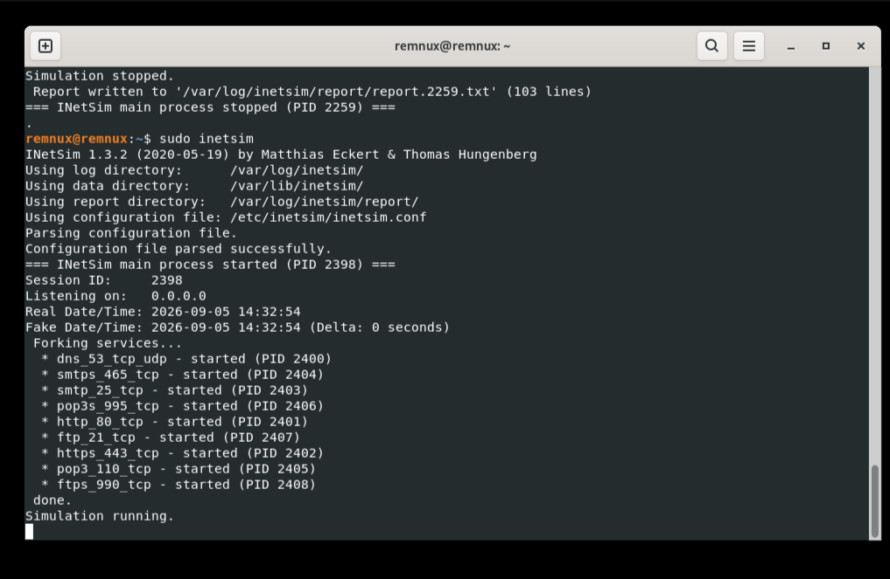
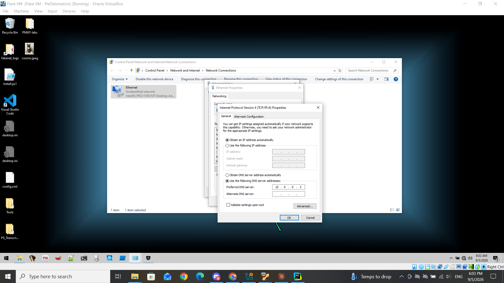

# Setup: 

## Virtual Machines

  For the scope of Malware Analysis I've set up two virtual machines:
  1. **Flare-VM:** A Windows Flare-VM machine that will be the target of different malware.
  
  

  2.  **Remnux:** A Linux Remnux machine that we will use to analyze, examine and decipher the effects of the malware deployed 

## Safety Features

In order to guarantee the safety of our network and the computer the virtual machines are running on, the machines have both been connected to a separate network through VirtualBox's network feature.

 In order to not mistake this second network with a normal network we might find in our system, we have modified its address to be in the 10.0.0.1/24 prefix ranges.

Additionally, to always be able to find all the differences between the default state of the machine and the one after the deployment of a malware and to not have multiple malware effects we might've missed stack over on the same machine, we have taken snapshots of the default state of the Flare-VM machine before detonating any malware.

From Remnux, we'll also run INetSim in order to track what the malware samples we are analyzing might get from the web and to make sure they don't get any extra stuff. 

So now, inside of Flare VM, we'll set our prefered dns to be the one from the Remnux machine. 

